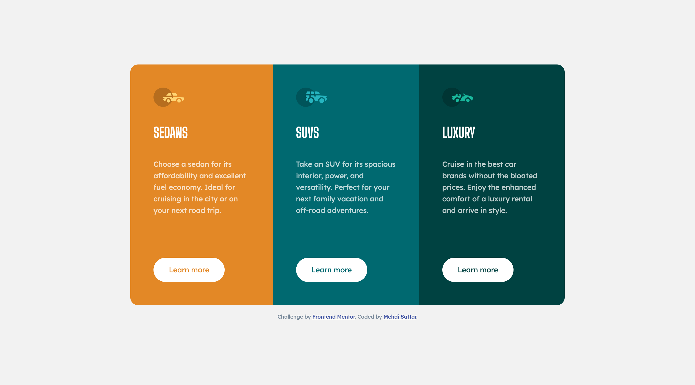

# Frontend Mentor - 3-column preview card component solution

Live Solution: [3-column preview card component solution](https://fem-io-007-3-column-card-component.vercel.app/)

This is a solution to the [3-column preview card component challenge on Frontend Mentor](https://www.frontendmentor.io/challenges/3column-preview-card-component-pH92eAR2-). Frontend Mentor challenges help you improve your coding skills by building realistic projects. 

## Author

Mehdi Saffar

- LinkedIn - [@mehdisaffar](https://www.linkedin.com/in/mehdisaffar/)
- Frontend Mentor - [@MehdiSaffar](https://www.frontendmentor.io/profile/MehdiSaffar)
